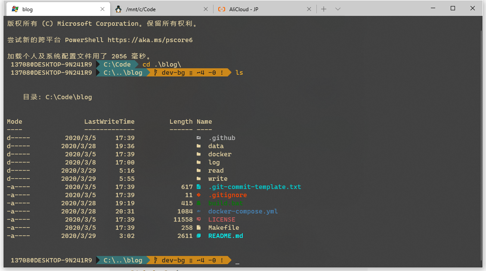
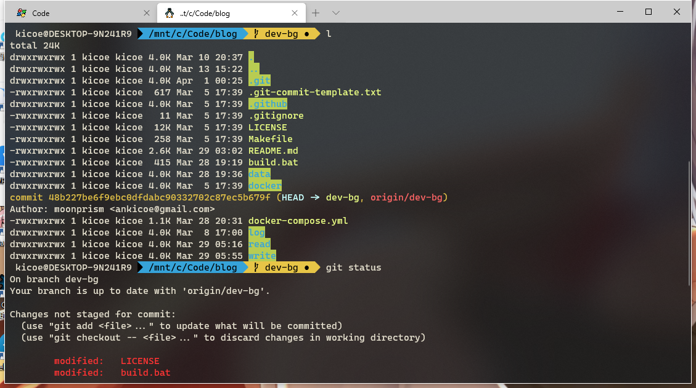

# Windows Terminal Env



## Settings

```js
{
    "profiles":
    {
        // 全局通用的默认配置
        "defaults":
        {
            "fontFace": "Delugia Nerd Font",
            "fontSize": 10,
            // 光标样式 "vintage" ( ▃ ), "bar" ( ┃ ), "underscore" ( ▁ ), "filledBox" ( █ ), "emptyBox" ( ▯ )
            "cursorShape": "underscore",
            // 亚克力背板
            "useAcrylic": true,
            // 背板透明度
            "acrylicOpacity": 0.8
        },
        "list": [
            // 每项的单独配置
            {
                // 生成 guid 可以用 Powershell 命令 [guid]::NewGuid()
                "guid": "{61c54bbd-c2c6-5271-96e7-009a87ff44bf}",
                "name": "Windows PowerShell",
                "commandline": "powershell.exe",
                // 颜色样式
                "colorScheme": "Gruvbox Dark",
                "hidden": false
            },
            {
                "guid": "{4dcf890b-2a4d-4aee-ad84-9d2fc9272dde}",
                "name": "Git Bash",
                // 后面可以接 -c \"ssh root@xx.com\" 作为ssh连接终端
                "commandline": "\"%PROGRAMFILES%\\git\\usr\\bin\\bash.exe\" -i -l",
                // ms-appdata///Local/指向当前profiles.json文件所在目录
                "icon": "ms-appdata:///Local/git.png",
                "hidden": false
            }
        ]
    },
    "schemes": [
        // 每一项配置一个颜色样式
        // 可以到这里挑喜欢的 https://github.com/mbadolato/iTerm2-Color-Schemes/tree/master/windowsterminal
        {
            "name": "Gruvbox Dark",
            "black": "#1e1e1e",
            "red": "#be0f17",
            "green": "#868715",
            "yellow": "#cc881a",
            "blue": "#377375",
            "purple": "#a04b73",
            "cyan": "#578e57",
            "white": "#978771",
            "brightBlack": "#7f7061",
            "brightRed": "#f73028",
            "brightGreen": "#aab01e",
            "brightYellow": "#f7b125",
            "brightBlue": "#719586",
            "brightPurple": "#c77089",
            "brightCyan": "#7db669",
            "brightWhite": "#e6d4a3",
            "background": "#1e1e1e",
            "foreground": "#e6d4a3"
        }
    ],
}
```

## Powershell

### oh-my-posh

<https://github.com/JanDeDobbeleer/oh-my-posh>

安装

```
Install-Module posh-git -Scope CurrentUser
Install-Module oh-my-posh -Scope CurrentUser
```

使用

```
# Start the default settings
Set-Prompt
# Alternatively set the desired theme:
Set-Theme Agnoster
```

解决乱码

[下载字体](https://github.com/seven-original-sins/windows-terminal-env/raw/master/Delugia.Nerd.Font.Complete.ttf)，右键安装

### Terminal-Icons

<https://github.com/devblackops/Terminal-Icons>

安装

```
Install-Module -Name Terminal-Icons -Repository PSGallery
```

使用

```
Import-Module -Name Terminal-Icons
```

## Scoop

<https://scoop.sh/>

安装

```
iwr -useb get.scoop.sh | iex
```

使用

```
scoop install vim
```

## Powershellrc

```
vim ~\Documents\WindowsPowerShell\Microsoft.PowerShell_profile.ps1
```
将以上的设置命令写入启动项
```
Set-Prompt
Import-Module -Name Terminal-Icons
```

## WSL

### zsh

虽然以前在mac下用惯了oh-my-zsh，但配了半天感觉还是没有oh-my-posh好看。

